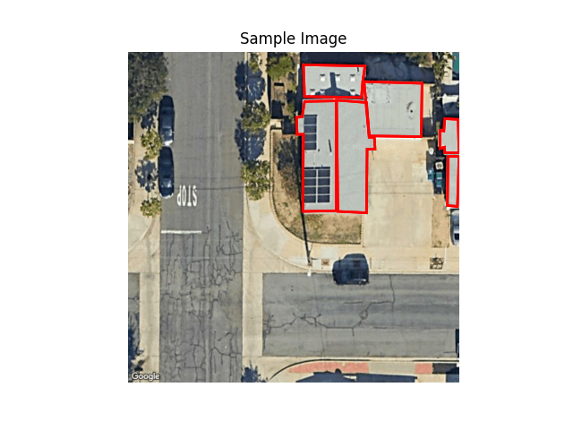

## Eyepop.ai Machine Learning Take Home Project: Roof Tile Detection

Welcome to the take-home project for the Machine Learning Engineer position at Eyepop.ai! The instructions may seem intentionally vague — this is to give you room to demonstrate your design thinking and technical creativity. 

**This is not a Kaggle competition**: we care more about clarity, correctness, and logical implementation than leaderboard scores, thus having a GPU is not required and won't be a factor in your evaluation.

If you have any questions, feel free to reach out to [blythe@eyepop.ai](mailto:blythe@eyepop.ai).

---

### **Goal**

You are provided with top-down satellite images from Google Maps. Your task is to detect each section of a roof that forms a single flat surface. These flat surfaces (or roof tiles) could be used by a solar panel instalation company to determine the surface available for installation and help them generate a quote automatically. The roof tiles should be identified as a polygon with an arbitrary number of vertices representing the endpoints or corners as keypoints. Instead of fitting simple bounding boxes (as that would produce an inaccurate quote), we’d like you to design and train a keypoint detection model that predicts an arbitrary number of keypoints per roof tile, and arbitrary number of roof tiles per image. See example image below.

Each red polygon is a roof tile, and some has 8 vertices, while other have 4.



---

### **Dataset**

Data is stored with the following structure:

```
/data/
  images/             # Directory containing 100 images
  dataset.parquet     # A Parquet file with annotations
```

The annotations file is a pandas dataframe, where each row is a dictionary form of the pydantic type from Eyepop SDK's  [Asset](https://github.com/eyepop-ai/eyepop-sdk-python/blob/bd69965146984de810d77daea8b10f7ce8839c0e/eyepop/data/data_types.py#L254).
- `asset_url` is a relative path to images under `/data/images/`.
- `partition` is split into 80 train, 10 val, and 10 test.
- `annotations` is a nested dictionary. Note that there are two dimensions you can use to point to the first element.
```python
# Per image, should always point to the first annotation, reserved for ground truth
roofs = row["annotations"][0]["objects"]
# Per roof, should always point to the first keypoint set. We only support single keypoint set per object.
keypoints = roof["keyPoints"][0]["points"]
```

---

### **Expected Deliverables**

Please include all of the following in this GitHub repository:

1. **Training script**

   - A Python script that trains models and saves relevant artifacts in the `outputs/` directory.

2. **Validation script**

   - A script that loads the trained model, runs inference on a validation set, writes predicted keypoints into `outputs/output.parquet` (in the same format as `data/dataset.parquet`), and prints a summary score that reflects how accurately the predicted keypoints match the ground truth.

3. **Model Output Directory**

   - All artifacts (e.g. trained model, predictions) should be saved in `/outputs/`.

4. **README.md**

   - Setup instructions (environment, dependencies)
   - How to run training and validation scripts
   - Brief explanation of your approach
     - Keep this section high-level and concise — we will review your code directly for details.

---

### **What We're Looking For**

- A reasonable proof-of-concept level model. Does not need to be state-of-the-art, but needs to convince us your solution is viable to invest more time in.
- A **reproducible** solution, from environment setup to running training and validation.
- Clear and modular code structure.
- Concise and sufficient comments to help others quickly understand your implementation.

---

### **What We’re *****Not***** Looking For**
- Submissions that rely heavily on GPU acceleration or brute-force training to achieve high performance. We prioritize sound model design, clarity of implementation, and reproducibility over raw score or scale of compute used.